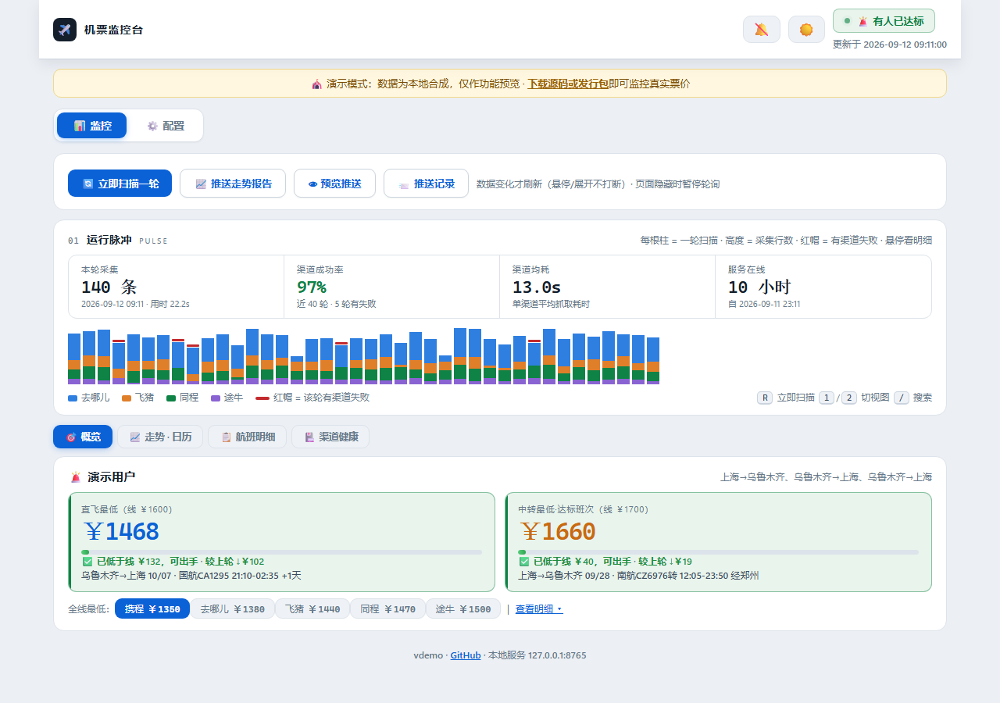
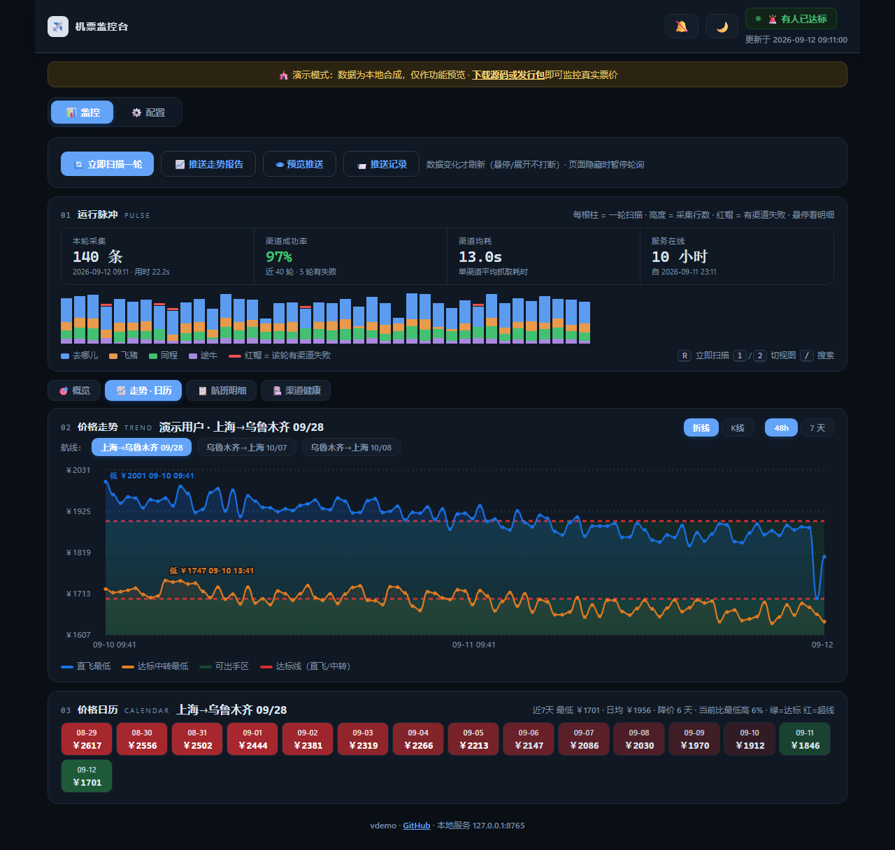
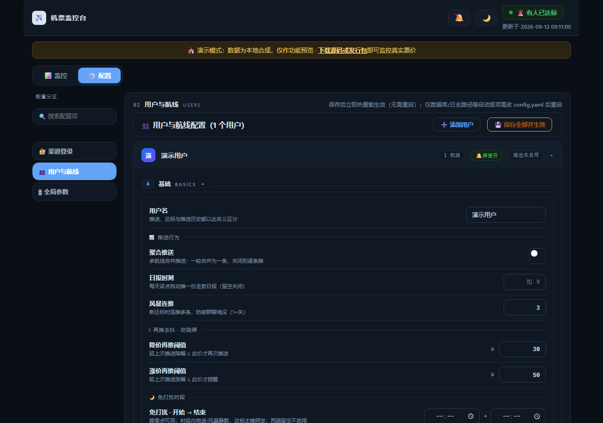
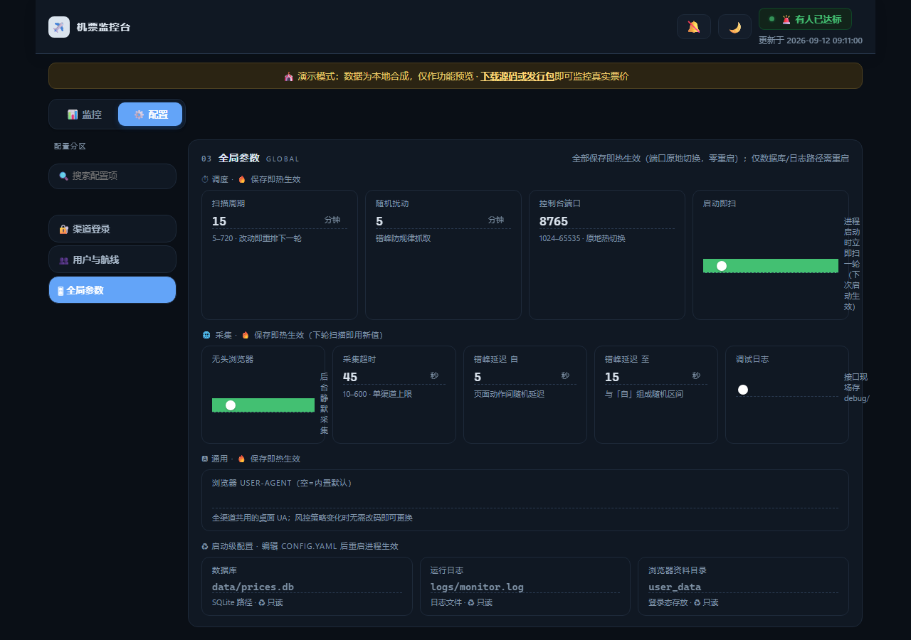
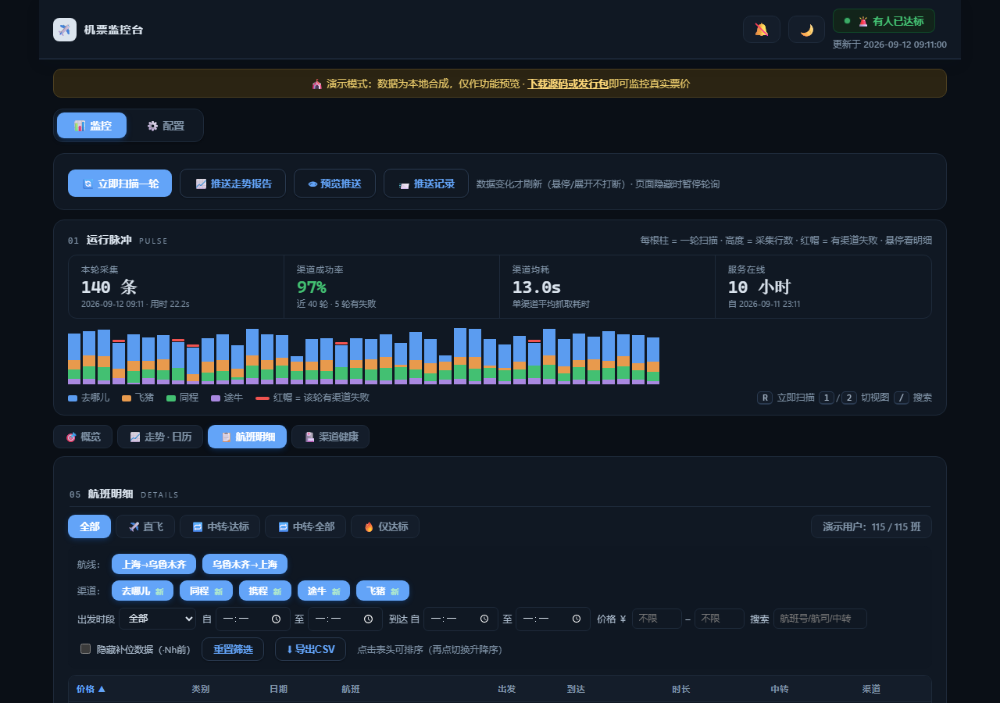
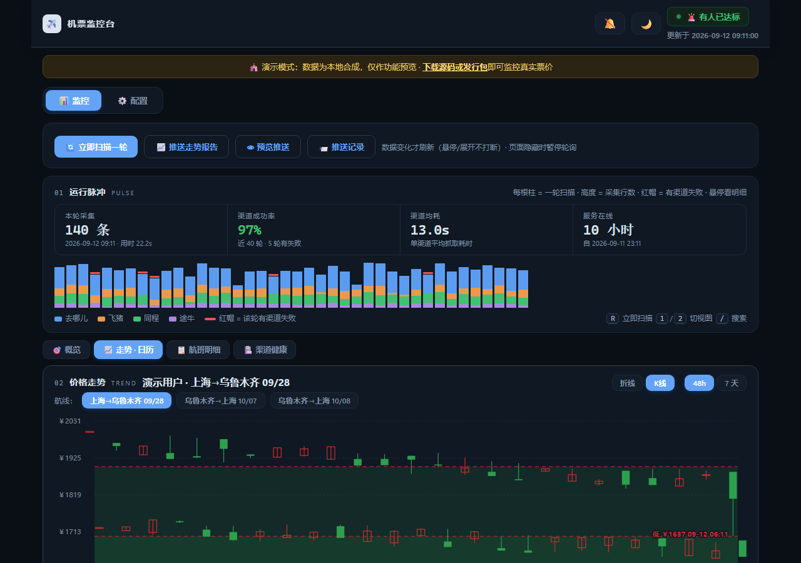
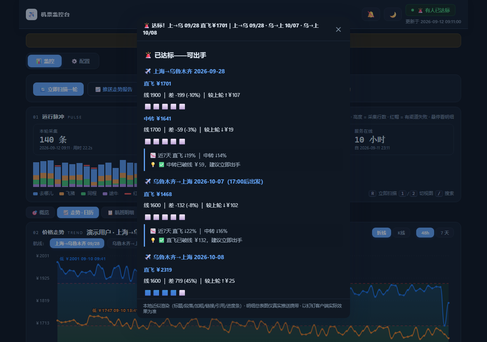
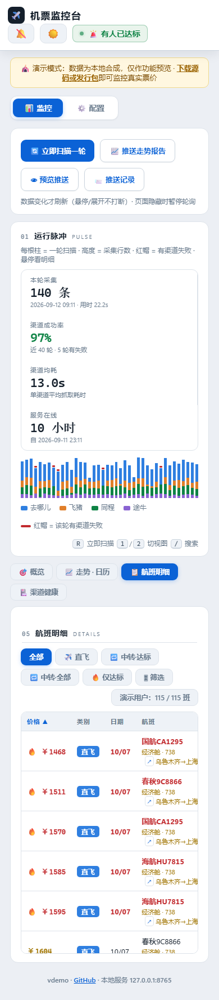

# ✈️ ticket-monitoring 机票监控

> 自托管的多渠道机票价格监控：五平台明细采集 → 钉钉图文推送 → 达标四层强提醒。
> 数据留在本机，配置全在网页，开源免费。

[](https://dengmeiluan.github.io/ticket-monitoring/site/)
[](https://github.com/dengmeiluan/ticket-monitoring/releases)
[](https://github.com/dengmeiluan/ticket-monitoring/actions/workflows/ci.yml)
[](https://www.python.org)
[]()
[](LICENSE)

**[🎪 点开即玩的在线演示](https://dengmeiluan.github.io/ticket-monitoring/site/)** · [English README](README_EN.md) · [下载 Windows 发行包](https://github.com/dengmeiluan/ticket-monitoring/releases)

```
❌ 全部未达标｜最近 上→乌 09/25 直飞差￥120｜上→乌 09/25 · 乌→上 10/04 · 乌→上 10/05
├─ ## ✈️ 上海→乌鲁木齐 2026-09-25
│    直飞 ￥2470 ｜ 线 ￥1900 ｜ 距线 ￥570（30%）较上轮 ↓￥30
│    🟦🟦🟦⬜⬜
│    💡 🧘 直飞高于线 30%，继续观望 ｜ 📉 近7天 直飞 ↓8% ｜ 中转 ↓3%
│    [价格走势折线图]
├─ ## ✈️ 乌鲁木齐→上海 2026-10-04（仅 17:00–23:59 出发）
│    ……
├─ [三航线合并明细总表（价格彩色=达标）]
└─ ⚖️ 同班跨渠道比价：途牛￥2470 ＜ 同程￥2600（可省 ￥130）
```

达标时：标题变 🚨、群里 @你的手机号、风暴连推、（可选）ntfy 手机弹窗+铃声穿透免打扰、（可选）阿里云电话/短信。

## 控制台一览

签派控制台设计语言：数字即主角（mono 等宽）、分区编号标签、hairline 分区。
主页是**子视图工作台**（概览 / 走势·日历 / 航班明细 / 渠道健康，一屏一会话），
配置页是**面板式设置台**（左侧分区切换，同屏只显一个分区，没有长滚动）。









<details>
<summary>更多截图：航班明细 / K线 / 推送预览 / 移动端</summary>









</details>

### 键盘快捷键

| 键 | 作用 |
|---|---|
| `1` / `2` | 监控台 / 配置台 切换 |
| `Ctrl/⌘ + S` | 配置页保存并热生效 |
| `R` | 立即扫描一轮（3 秒内再按一次确认，防手滑） |
| `/` | 聚焦明细搜索框 |
| `Esc` | 关闭弹层 / 收起同班比价展开行 |

## 特性矩阵

| 能力 | 说明 |
|---|---|
| 五渠道明细 | 去哪儿/飞猪/携程/同程/途牛，统一 schema（价格/航班号/时刻/中转/跨天/时长）；**逐渠道以 PC 版为准**（qunar PC 主路径+H5 兜底、飞猪 PC 直读），httpx 直连渠道零浏览器开销 |
| 多租户 | 多用户各自航线/阈值/钉钉群；同航线去重采集、查询错峰防限流 |
| 达标判定 | 直飞/中转独立阈值；中转须满足到达约束；出发时段窗口；只认当轮实时数据 |
| 聚合推送 | 多航线一轮一消息；**达标航线小节自动置顶**；KPI 三行制 + 进度条 + **💡 操作建议** + **📉 7 天趋势** |
| 同班比价 | 同一航班各渠道最低价并排，按「最大可省」排序 |
| 强提醒 | 钉钉 @手机号 + 风暴连推 + **Windows 右下角弹窗（点击看单条全量详情）** + ntfy 弹窗铃声 + 阿里云电话短信；2h/再降￥50 去抖 |
| 走势图 | 平滑曲线+渐变面积/**K线双模**（涨红跌绿、OHLC 悬停）；48h/7 天范围；最低点标注 |
| 价格日历 | 近 14 天逐日直飞最低热力卡 + **近 7 天洞察**（最低/日均/降价天数/距最低幅度） |
| 免打扰时段 | 跨零点窗口（如 23:00–07:00）：时段内省略行情心跳/风暴连推/电话短信，**达标主推与 ntfy 照发** |
| 推送历史 | 📨 每次发送自动存档（含成功/失败），控制台随时回看，可展开钉钉近似渲染全文 |
| 渠道健康 | 近 24h 逐轮成功/降级/失败/维护条纹 + 成功率，**点击格子看该轮日志** |
| **运行脉冲** | 每轮每渠道行数/耗时环形缓冲：概览条 4 格 mono 大数字 + 近 40 轮**堆叠脉冲柱**（红帽=有渠道失败），采集是否健康一眼可辨 |
| **子视图工作台** | 主页四个子视图（概览/走势·日历/明细/健康）一屏一会话，记忆上次所在视图；切换零 DOM 插拔（翻译/比价扩展免疫） |
| **面板式配置台** | 配置页左侧分区切换（渠道登录/用户与航线/全局参数），同屏只显一个分区，**告别长滚动** |
| **全局配置中心** | 调度（周期/扰动/端口/启动即扫）· 采集（无头/超时/错峰区间/调试/UA）**全量热载**；启动级配置（数据库/日志/浏览器资料）如实标注 ♻ 只读；每个通道一个「测试」按钮：钉钉/ntfy 用表单当前值实测，**Windows 弹窗一键真发** |
| **配置搜索/导入导出** | 🔍 字段级搜索（跨分区命中过滤）；📤 导出 / 📥 导入配置 JSON（含凭据本机自管）；保存前**脏改动计数** + 端口/日期/重复航线/超时校验；`Ctrl/⌘+S` 保存 |
| 推送预览 | 👁 本地渲染钉钉消息近似效果，改格式不用等自然轮 |
| 浏览器通知 | 🔔 达标桌面通知 + 提示音（按价去重） |
| **Windows 弹窗** | 达标右下角系统弹窗+提示音，**点击直达单条详情页**（/notify/{nid}，不必打开控制台）；钉钉推送同链路附「📲 完整详情」链接 |
| 明细表 | 筛选/排序/日期列/搜索/近达标琥珀/同班比价展开/CSV 导出/每行直达下单页 |
| **配置全热加载** | 航线/阈值/推送/扫描周期/扰动/**端口原地切换**/无头模式/采集超时/错峰间隔/日报时刻/图床——保存即生效，**零重启** |
| 网页登录 | 🔐 配置页一键弹出各渠道登录窗口，点「我已登录完成」保存会话即生效，**免命令行** |
| 演示模式 | `python webui.py --demo` 零配置体验；在线演示站 = 静态烘焙同源页面 |
| 数据窗口 | 自动清理 14 天前明细；走势图回看 48h/7 天 |
| 可靠性 | 调度互斥锁、钉钉 -1 单发零重试、渠道失败可见、启动首轮节流 |

## 快速开始（免装 Python）

1. 到 [Releases](https://github.com/dengmeiluan/ticket-monitoring/releases) 下载最新的 `ticket-monitoring-vX.Y.Z-win64.zip`（约 68MB）
2. 解压到任意目录，双击 `机票监控.exe`
3. 浏览器打开 `http://127.0.0.1:8765` → ⚙️ 配置：
   - 航线（城市中文输入，50 城自动联想；可配多条，每条独立阈值/日期/出发时段）
   - 直飞心理价 / 中转心理价 / 中转最晚到达时刻
   - 钉钉机器人 Webhook + 加签密钥（[创建方法](#钉钉机器人配置)），点「🔔 测试推送」即验
4. 保存即热重载生效，监控开始

> 携程渠道需要登录态：控制台「⚙️ 配置 → 🔐 渠道登录」一键弹窗登录保存（或 `机票监控.exe --login ctrip`）；其余四渠道开箱即用。

## 从源码运行

```bash
git clone https://github.com/dengmeiluan/ticket-monitoring.git
cd ticket-monitoring
pip install -r requirements.txt
playwright install chromium
python main.py            # 无 config.yaml 时会引导生成，或复制 config.example.yaml
```

本地控制台同样在 `http://127.0.0.1:8765`；零配置体验演示数据：`python webui.py --demo`。

## 架构

```
main.py            编排：航线去重 → 渠道线程池并发采集 → 多用户聚合分发 → 四层强提醒
crawlers/          五渠道：qunar(浏览器DOM兜底) / ctrip / tongcheng(XHR拦截)
                   / fliggy(PC SSR直读) / tuniu(httpx逆向)
core/alerter.py    一轮一消息聚合推送；_digest_payload 纯构建器（控制台预览复用）
core/pulse.py      扫描脉冲记录器：每轮每渠道 行数/耗时 环形缓冲 → /api/pulse
core/health.py     渠道健康时间线（monitor.log 解析，维护态锁存）
core/demo.py       演示数据（真实 schema 临时库，确定性种子）
webui.py           内嵌单页控制台（纯标准库；子视图工作台+面板式配置；配置全热加载）
report.py          走势图/明细总表 PNG（Pillow）→ 图床
docs/              uitest 全功能自检 / screenshot 截图 / demo_build 静态站烘焙 / LESSONS
```

## 钉钉机器人配置

1. 钉钉群 → 群设置 → 智能群助手 → 添加机器人 → **自定义**（Webhook 接入）
2. 安全设置选 **加签**，复制密钥（SEC 开头）
3. 复制 Webhook 地址，填入配置页对应输入框，点「🔔 测试推送」验证

## 配置说明

全部配置在网页 ⚙️ 配置页完成，**保存即热生效（零重启）**：航线/阈值/出发时段、钉钉/ntfy/阿里云通知、扫描周期与扰动、控制台端口（原地切换）、无头浏览器、采集超时/错峰间隔、每日日报时刻、图床。`config.yaml` 只是落盘格式；仅数据库/日志路径为启动级（见 `config.example.yaml`）。

## 常驻运行

仓库根自带三个 PowerShell 脚本：

```powershell
.\start.ps1    # 后台启动监控（PID 落 .monitor.pid，日志在 logs/）
.\status.ps1   # 查看进程/端口/最近一轮状态
.\stop.ps1     # 停止监控
```

开机自启：任务计划程序 → 创建基本任务 → 触发器选「登录时」→ 操作选启动 `start.ps1`（或 `schtasks /create /tn TicketMonitor /sc onlogon /tr "powershell -File D:\path\start.ps1"`）。

## 打包可执行文件

```bash
pip install pyinstaller
pyinstaller TicketMonitor.spec --noconfirm
# dist/TicketMonitor/ 即完整分发包（含 Playwright 运行时）
```

## 开发

```bash
python tests/test_core_units.py   # 纯函数单测（36 用例）
python tests/test_alert_path.py   # 推送链路离线演练（24 断言）
python docs/uitest.py             # 全功能 UI 自检（94 断言，自动拉起演示控制台）
python docs/screenshot.py         # README 截图再生成（先起 --demo 演示服）
python docs/demo_build.py         # 重烘在线演示站（docs/site）
```

踩坑与解法沉淀见 [docs/LESSONS.md](docs/LESSONS.md)；提交贡献前请读 [CONTRIBUTING.md](CONTRIBUTING.md)（TDD 纪律与发版流程）。安全相关问题请走 [SECURITY.md](SECURITY.md) 的私密通道。

## FAQ

**Q：页面一直开着会很耗吗？**
A：轮询带签名缓存 + ETag/304——数据没变时服务端零重算、浏览器零下载；页面隐藏自动暂停轮询，切回立即补一次。

**Q：推送报 -1「系统繁忙」？**
A：钉钉网关的"幽灵送达"——报错但消息常已入群。策略为单发零重试，丢失由下轮心跳自然补（达标场景电话通道独立兜底）。

**Q：飞猪价格为什么比别家低几十到一百？**
A：飞猪 PC 端展示的是不含税裸价，其余渠道为含税价，属数据口径差异。

**Q：携程提示「本轮无数据渠道」？**
A：登录态过期，重跑一次 `--login ctrip` 扫码即可。

**Q：改配置要重启吗？**
A：不用。航线/阈值/通知/扫描周期/扰动/端口/无头/超时/错峰/日报时刻/图床全部保存即热生效；仅数据库/日志路径是启动级配置。

**Q：会泄露我的配置吗？**
A：凭据只存本机 `config.yaml`（gitignore 拦截）；演示模式/在线站均为合成数据，配置页不回读真实凭据。

## License

Apache-2.0（见 [LICENSE](LICENSE)）。仅供个人学习研究，请遵守各平台服务条款。
